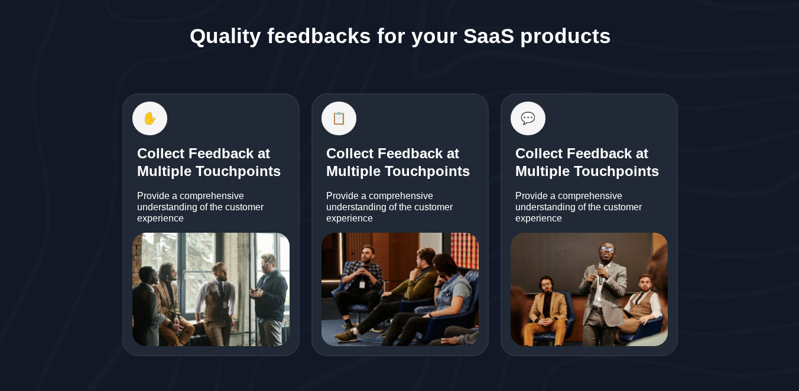

<h1>SaaS Feedback Feature Cards</h1>

This is a UI component built using <strong>HTML</strong> and <strong>CSS</strong> that displays feature cards related to collecting user feedback for SaaS products. Each card includes an icon, a heading, a short description, and an image to visually support the message.

<h2>📸 Preview</h2>

  

<h2>🔧 Built With</h2>
<ul>
  <li>HTML5</li>
  <li>CSS3</li>
  <li>Flexbox for layout</li>
</ul>

<h2>📁 Folder Structure</h2>
<pre>
project/
├── index.html
├── style.css
└── Tablet_1024px.jpg

</pre>

<h2>✍️ Description</h2>

  The layout contains three feature cards used to highlight key elements of a feedback system for SaaS products. The design is clean and minimal, suitable for showcasing product features or benefits in a landing page or product section.

<h2>📬 Contact</h2>

  For suggestions or collaboration, feel free to reach out via GitHub or open an issue.

<h2>📄 License</h2>

This project is licensed under the <a href="https://opensource.org/licenses/MIT">MIT License</a>.

